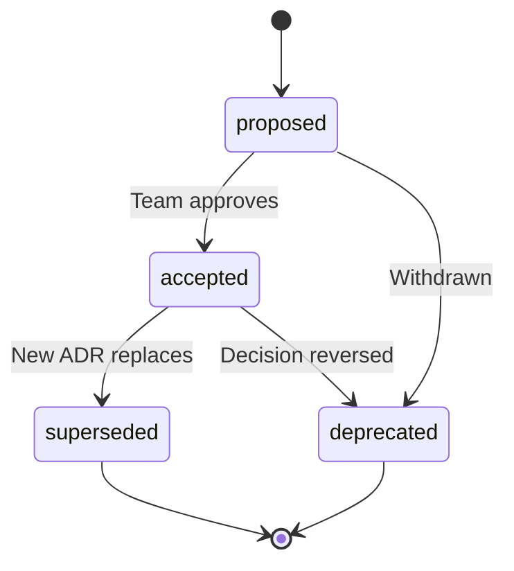

# Architectural Decision Records (ADR) — Product Spec

**Status:** Draft  
**Author:** Orbit Docs team  
**Last updated:** 2026-08-07 (Settings page access model)

---

## 1. Problem Statement

Clients expect that when they record an **Architectural Decision** in Orbit Docs, every connected agent (MCP clients, doc generation, doc chat) will:

1. **Discover** the decision before acting
2. **Treat it as binding** — higher priority than code inference, generated docs, or general knowledge
3. **Not contradict** accepted ADRs unless explicitly asked to supersede one

Today, Orbit Docs stores documentation but has **no first-class ADR type** and **no enforcement layer**. A manual doc titled "ADR: Use JWT" is indistinguishable from any other doc. Agents may never retrieve it, and nothing instructs them to prioritize it.

This spec defines how to make ADRs **discoverable, machine-readable, and binding** across all agent touchpoints.

---

## 2. Goals

| # | Goal |
|---|------|
| G1 | ADRs are a distinct `doc_type` with structured frontmatter |
| G2 | MCP agents fetch accepted ADRs before architecture/doc recommendations |
| G3 | Doc generation injects accepted ADRs as mandatory constraints |
| G4 | Doc chat includes accepted ADRs in app-level context |
| G5 | **Settings → Architectural Decisions** is the dedicated admin surface for creating and governing ADRs |
| G6 | Only `accepted` ADRs are binding; `proposed`, `deprecated`, `superseded` are informational |
| G7 | ADR management in Settings is restricted to **admin** and **super admin** roles only |

## 3. Non-Goals (v1)

- Automated ADR generation from Git commits or PRs
- ADR approval workflows beyond existing doc status (`draft` → `in_review` → `published`)
- Write access for MCP agents (ADRs remain human-authored)
- Cross-workspace ADR inheritance
- Real-time ADR violation blocking in CI (deferred to v2 verification hook)

---

## 4. ADR Concept

An ADR captures a **deliberate architectural choice** with enough structure for agents to apply it as a constraint.

### 4.1 Lifecycle



| `adr_status` (frontmatter) | Binding? | Agent behavior |
|----------------------------|----------|----------------|
| `proposed` | No | May reference; do not enforce |
| `accepted` | **Yes** | Must follow; cite when relevant |
| `deprecated` | No | Historical context only |
| `superseded` | No | Follow the superseding ADR instead |

**Binding rule:** An ADR is binding when **both** conditions hold:

1. `doc_type = "adr"`
2. `frontmatter.adr_status = "accepted"`
3. `docs.status = "published"` (optional strict mode — see §4.4)

### 4.2 Relationship to doc status

Orbit Docs already has `docs.status` (`draft`, `in_review`, `published`, `archived`). ADR lifecycle is **orthogonal**:

| `docs.status` | `adr_status` | Effective binding |
|---------------|--------------|-------------------|
| `published` | `accepted` | **Binding** |
| `published` | `proposed` | Visible, not binding |
| `draft` | `accepted` | Not binding (work in progress) |
| `archived` | any | Not binding |

Default v1 rule: **only `published` + `accepted` ADRs are binding.** Draft accepted ADRs are visible to authenticated users but excluded from agent constraint injection.

### 4.3 Scope

ADRs are **app-scoped** (`docs.app_id` required). Optional `scope` frontmatter narrows applicability:

```yaml
scope: [backend, api, auth]
```

Agents apply an ADR only when the user's question or task falls within its scope. If `scope` is omitted, the ADR applies to the entire app.

---

## 5. Data Model

### 5.1 Schema change

**File:** `server/database/schema/apps.ts`

Add `"adr"` to the `docType` enum:

```ts
docType: text("doc_type", {
  enum: ["srs", "fsd", "sdd", "git_snapshot", "feature", "adr"],
}),
```

No new table. ADRs reuse `docs` with `source = "manual"` (default).

### 5.2 Frontmatter schema

**File:** `types/adr.ts` (new)

```ts
export type AdrStatus = "proposed" | "accepted" | "deprecated" | "superseded";

export interface AdrFrontmatter {
  /** ADR lifecycle status. Default: "proposed" */
  adr_status?: AdrStatus;

  /** Sequential number within the app, e.g. 7 → "ADR-007" */
  adr_number?: number;

  /** ID of the ADR doc this one supersedes (when adr_status = "superseded" on the old one) */
  supersedes?: string;

  /** Narrow applicability. Omit = entire app. */
  scope?: string[];

  /** ISO date when the decision was accepted */
  date?: string;

  /** Decision makers (names or emails) */
  deciders?: string[];
}
```

### 5.3 JSON Schema (for validation & ADI integration)

**File:** `schemas/adr-frontmatter.schema.json` (new)

```json
{
  "$schema": "https://json-schema.org/draft/2020-12/schema",
  "$id": "https://orbit-docs.dev/schemas/adr-frontmatter.json",
  "title": "ADR Frontmatter",
  "type": "object",
  "properties": {
    "adr_status": {
      "type": "string",
      "enum": ["proposed", "accepted", "deprecated", "superseded"],
      "default": "proposed"
    },
    "adr_number": { "type": "integer", "minimum": 1 },
    "supersedes": { "type": "string", "format": "uuid" },
    "scope": {
      "type": "array",
      "items": { "type": "string", "minLength": 1 }
    },
    "date": { "type": "string", "format": "date" },
    "deciders": {
      "type": "array",
      "items": { "type": "string" }
    }
  },
  "additionalProperties": true
}
```

### 5.4 Content template

**File:** `templates/adr_template.md` (new)

```markdown
# ADR-{{ADR_NUMBER}}: {{TITLE}}

| Field | Value |
|-------|-------|
| **Status** | {{ADR_STATUS}} |
| **Date** | {{DATE}} |
| **Deciders** | {{DECIDERS}} |
| **Scope** | {{SCOPE}} |

## Context

What is the issue or force that motivates this decision?

## Decision

State the architectural choice in one or two clear sentences. Use imperative language ("We will…", "All APIs must…").

## Consequences

### Positive

- …

### Negative

- …

## Alternatives Considered

| Alternative | Why rejected |
|-------------|--------------|
| … | … |
```

### 5.5 Display helpers

**File:** `utils/doc-display.ts`

```ts
export const DOC_TYPE_LABELS = {
  // …existing
  adr: "ADR",
};

export function isAdrDoc(doc: DocItem): boolean {
  return doc.docType === "adr";
}

export function isBindingAdr(doc: DocItem): boolean {
  if (!isAdrDoc(doc)) return false;
  if (doc.status !== "published") return false;
  const fm = doc.frontmatter as AdrFrontmatter | undefined;
  return fm?.adr_status === "accepted";
}

export function adrDisplayLabel(doc: DocItem): string {
  const fm = doc.frontmatter as AdrFrontmatter | undefined;
  const num = fm?.adr_number;
  const prefix = num != null ? `ADR-${String(num).padStart(3, "0")}` : "ADR";
  return `${prefix}: ${doc.title}`;
}
```

### 5.6 Query helper

**File:** `server/lib/adr-queries.ts` (new)

```ts
export async function listBindingAdrs(
  db: Db,
  appId: string,
  options?: { scope?: string; includeContent?: boolean },
): Promise<McpDocRow[]>;

export function formatAdrConstraintSummary(rows: McpDocRow[]): string;
```

Query:

```sql
SELECT * FROM docs
WHERE app_id = $1
  AND doc_type = 'adr'
  AND status = 'published'
  AND frontmatter->>'adr_status' = 'accepted'
ORDER BY (frontmatter->>'adr_number')::int NULLS LAST, created_at;
```

Scope filter (when provided): ADR applies if `scope` is null/empty OR overlaps with requested scope.

---

## 6. UI

ADR **management** lives exclusively in Settings. The `/docs` page may surface published ADRs as read-only reference material for users with `docs:read`, but non-admin users cannot create, edit, or change ADR lifecycle status from anywhere in the app.

### 6.1 Settings → Architectural Decisions (primary surface)

**Route:** `/settings?tab=adr`  
**Access:** `admin` role or `isSuperAdmin` only. All other roles (`product_manager`, `tech_writer`, `viewer`) do not see the tab and receive `403` on direct navigation or API calls.

This follows the existing Settings pattern (`pages/settings/index.vue`) where super-admin-only tabs (General, Team, Access, Integrations, SSO) are gated separately from role-scoped tabs.

#### Tab visibility

**File:** `pages/settings/index.vue`

```ts
type SettingsTabId =
  | "general"
  | "team"
  | "access"
  | "integrations"
  | "sso"
  | "mcp"
  | "adr";

const settingsTabs = computed(() => {
  const tabs: { id: SettingsTabId; label: string }[] = [];

  if (isSuperAdmin.value) {
    tabs.push(
      { id: "general", label: "General" },
      { id: "team", label: "Team Members" },
      { id: "access", label: "Access" },
      { id: "integrations", label: "Integrations" },
      { id: "sso", label: "SSO" },
    );
  }

  // Admin + super admin only
  if (isSuperAdmin.value || role.value === "admin" || can("adrs:read")) {
    tabs.push({ id: "adr", label: "Architectural Decisions" });
  }

  tabs.push({ id: "mcp", label: "MCP Connection" });

  return tabs;
});
```

`?tab=adr` deep-link is allowed only when the user passes the same gate; otherwise redirect to the first allowed tab (same pattern as non-super-admin users opening `?tab=access`).

#### Page layout

**File:** `components/settings/AdrManager.vue` (new)

| Zone | Contents |
|------|----------|
| **Header** | Title, short description (“Binding rules agents must follow”), **New ADR** button |
| **App filter** | Dropdown of apps the admin can manage (all apps for super admin) |
| **Summary strip** | Counts: binding / proposed / superseded / deprecated for selected app |
| **ADR table** | Sortable list: ADR number, title, `adr_status`, doc status, scope, updated, actions |
| **Empty state** | Prompt to create the first ADR for the selected app |

Table columns:

| Column | Notes |
|--------|-------|
| ADR | `ADR-007` + title (link to editor) |
| App | App name (hidden when app filter is set) |
| ADR status | Badge: Proposed / Accepted / Deprecated / Superseded |
| Doc status | Draft / In review / Published / Archived |
| Binding | ✓ when published + accepted |
| Scope | Comma-separated tags or “All” |
| Updated | Relative time |
| Actions | Edit · Publish · Accept · Supersede · Archive |

Row actions enforce lifecycle rules (e.g. **Accept** sets `frontmatter.adr_status = "accepted"`; **Supersede** opens picker for replacement ADR).

#### Create / edit flow

**New ADR** opens inline panel or routes to `/settings/adr/new?appId=…` (admin-gated).

On create:

- `docType: "adr"`, `source: "manual"`
- Auto-suggest next `adr_number` for the selected app
- Pre-fill body from `templates/adr_template.md`
- Default `adr_status: "proposed"`, `docs.status: "draft"`

**Edit** uses the existing doc editor (`pages/docs/[id].vue`) with ADR-specific sidebar fields, but entry is only from Settings (or direct URL guarded by `adrs:write`). The generic **Docs → New** menu does **not** offer an ADR option.

#### ADR editor sidebar (when `docType === "adr"`)

- `adr_number` (read-only after publish, editable in draft)
- `adr_status` (proposed / accepted / deprecated / superseded)
- `scope` (tag input)
- `supersedes` (searchable ADR picker)
- `date`, `deciders`
- **Binding preview** — live indicator: “This ADR will be binding when published + accepted”

### 6.2 `/docs` read-only surfacing (secondary)

Published ADRs may appear in `/docs` as a read-only **Architectural decisions** section for users with `docs:read`, so teams can discover binding rules without opening Settings.

| Capability | `/docs` | Settings → ADR |
|------------|---------|----------------|
| View published ADRs | ✓ (read-only) | ✓ |
| View draft / in-review ADRs | ✗ | ✓ (admin only) |
| Create ADR | ✗ | ✓ |
| Edit content / frontmatter | ✗ | ✓ |
| Change `adr_status` | ✗ | ✓ |
| Publish / archive | ✗ | ✓ |

**File changes (read-only section):**

- `utils/doc-display.ts` — `isAdrDoc()`, optional ADR section in `buildSections()` (published only for non-admins)
- `pages/docs/index.vue` — render section with status badge; hide action buttons for non-admins

No **Docs → New → Architectural Decision** entry in v1.

---

## 7. MCP Server

### 7.1 New tool: `list_architectural_decisions`

**File:** `server/utils/mcp-server.ts`

```ts
{
  name: "list_architectural_decisions",
  description:
    "List Architectural Decision Records (ADRs) for an app. " +
    "ADRs with adr_status 'accepted' and status 'published' are BINDING constraints — " +
    "agents must follow them and must not recommend alternatives that violate them. " +
    "Call this BEFORE making architecture, API, or design recommendations.",
  inputSchema: {
    type: "object",
    properties: {
      appId: { type: "string" },
      appName: { type: "string" },
      adrStatus: {
        type: "string",
        enum: ["proposed", "accepted", "deprecated", "superseded"],
        description: "Filter by ADR lifecycle status. Omit to return all.",
      },
      bindingOnly: {
        type: "boolean",
        default: false,
        description: "When true, return only published + accepted ADRs.",
      },
      scope: {
        type: "string",
        description: "Filter ADRs applicable to this scope (e.g. 'backend', 'api').",
      },
      includeContent: { type: "boolean", default: true },
      limit: { type: "number", default: 50 },
    },
  },
}
```

**Response shape:**

```json
{
  "app": { "id": "…", "name": "MDM" },
  "bindingCount": 3,
  "adrs": [
    {
      "id": "uuid",
      "adrNumber": 7,
      "displayLabel": "ADR-007: Use OAuth 2.0 with PKCE",
      "title": "Use OAuth 2.0 with PKCE",
      "adrStatus": "accepted",
      "docStatus": "published",
      "binding": true,
      "scope": ["auth", "api"],
      "supersedes": null,
      "decision": "…extracted or full content…",
      "publicUrl": "https://docs.transtrack.id/p/…"
    }
  ],
  "constraintSummary": "BINDING ADRs:\n- ADR-007: All APIs must use OAuth 2.0 with PKCE\n- ADR-003: …"
}
```

### 7.2 New tool: `get_binding_constraints` (compact)

Returns only the `constraintSummary` string for prompt injection. Lighter than full ADR list when the agent just needs rules.

```ts
{
  name: "get_binding_constraints",
  description:
    "Get a compact summary of all binding (published + accepted) ADRs for an app. " +
    "Use at the start of any architecture or design task.",
  inputSchema: {
    type: "object",
    properties: {
      appId: { type: "string" },
      appName: { type: "string" },
      scope: { type: "string" },
    },
  },
}
```

### 7.3 Update server instructions

Append to MCP `instructions` array in `createMcpServer()`:

```
ARCHITECTURAL DECISION RECORDS (ADRs):
- ADRs are binding architectural constraints, not optional background.
- Before architecture, API design, or doc recommendations for an app, call
  list_architectural_decisions with bindingOnly=true (or get_binding_constraints).
- Published ADRs with adr_status "accepted" MUST be followed.
- If your answer conflicts with a binding ADR, follow the ADR and explain the conflict.
- Do not recommend alternatives that violate accepted ADRs unless the user explicitly
  asks to supersede or revisit the decision.
- ADRs with status "proposed", "deprecated", or "superseded" are informational only.
```

### 7.4 Update `list_app_documentation`

Include an **Architectural decisions** section (between Product and Knowledge base) when ADRs exist. Same pattern as Knowledge base: never collapsed for MCP (`collapseKnowledge: false` equivalent for ADRs).

### 7.5 Update `get_doc` response

When `docType === "adr"`, include:

```json
{
  "adr": {
    "number": 7,
    "status": "accepted",
    "binding": true,
    "scope": ["auth"],
    "supersedes": null
  }
}
```

---

## 8. Doc Generation Integration

### 8.1 Constraint injection

**File:** `server/lib/doc-prompts.ts`

Add helper:

```ts
export function prependAdrConstraints(
  prompt: string,
  constraintSummary: string,
): string {
  if (!constraintSummary.trim()) return prompt;
  return `BINDING ARCHITECTURAL DECISIONS (you MUST NOT contradict these):

${constraintSummary}

---

${prompt}`;
}
```

### 8.2 Fetch before every generation prompt

**File:** `server/lib/doc-generator.ts`

Before calling `buildPrdCreatePrompt`, `buildFsdUpdatePrompt`, `buildSddCreatePrompt`, etc.:

```ts
const constraints = await formatAdrConstraintSummary(
  await listBindingAdrs(db, appId, { includeContent: true }),
);
prompt = prependAdrConstraints(prompt, constraints);
```

Applies to: SRS/PRD, FSD, SDD (all repo types), SDD index.

Does **not** apply to: `git_snapshot` (descriptive, not prescriptive).

### 8.3 ADR-aware update prompts

Add to all update prompts:

```
When updating this document, preserve alignment with binding ADRs listed above.
If the codebase has drifted from an ADR, note the drift in a "Deviations" section
rather than silently overwriting the ADR's intent.
```

---

## 9. Doc Chat Integration

**File:** `server/api/chat.ts`

When `options.appId` is set (app-level or feature chat), prepend binding ADRs to the system prompt:

```ts
const constraints = await formatAdrConstraintSummary(
  await listBindingAdrs(db, options.appId),
);
if (constraints) {
  systemPrompt = `BINDING ARCHITECTURAL DECISIONS:\n${constraints}\n\n${systemPrompt}`;
}
```

Single-doc chat (`docId` set) on an ADR doc: use existing single-doc context; no extra injection needed.

---

## 10. Verification Layer (v2)

Optional post-generation check before saving generated docs.

**File:** `server/lib/adr-verification.ts` (new)

```ts
export interface AdrViolation {
  adrId: string;
  adrLabel: string;
  excerpt: string;
  reason: string;
}

export async function checkAdrCompliance(
  appId: string,
  generatedContent: string,
): Promise<AdrViolation[]>;
```

Implementation options:

1. **LLM judge** — pass content + binding ADRs to a small model; return violations
2. **Keyword/heuristic** — fast but brittle; not recommended as sole check

On violation: surface warnings in generation job UI; do **not** block save in v2 (advisory only).

---

## 11. AGENTS.md Sync (v2, optional)

For developers using Cursor without MCP, export binding ADRs to the app's linked Git repo.

**Trigger:** On ADR publish or `adr_status` → `accepted`  
**Output:** `docs/adr/ADR-007-oauth-pkce.md` + update `docs/adr/README.md` index  
**Config:** Per-app setting in Settings → Doc Generation

This is a convenience bridge, not the source of truth. Orbit Docs DB remains canonical.

---

## 12. API Changes

### 12.1 Settings ADR endpoints (admin-gated)

Dedicated routes under Settings keep ADR mutations out of the generic docs API surface and centralize authorization.

| Method | Path | Permission | Description |
|--------|------|------------|-------------|
| `GET` | `/api/settings/adrs` | `adrs:read` | List ADRs (all apps or `?appId=`) |
| `GET` | `/api/settings/adrs/{id}` | `adrs:read` | Single ADR with full content + frontmatter |
| `POST` | `/api/settings/adrs` | `adrs:write` | Create ADR for an app |
| `PUT` | `/api/settings/adrs/{id}` | `adrs:write` | Update content, frontmatter, doc status |
| `POST` | `/api/settings/adrs/{id}/accept` | `adrs:write` | Set `adr_status → accepted` (shortcut) |
| `POST` | `/api/settings/adrs/{id}/supersede` | `adrs:write` | Mark superseded + link replacement ADR |
| `GET` | `/api/settings/adrs/suggest-number?appId=` | `adrs:read` | Next `adr_number` for app |

All handlers call `requirePermission(event, "adrs:…")` via `server/utils/rbac.ts`. Super admins bypass permission checks (existing behavior).

**Files:** `server/api/settings/adrs/index.get.ts`, `index.post.ts`, `[id].get.ts`, `[id].put.ts`, etc.

### 12.2 Existing docs endpoints (read-only for ADRs)

Generic doc endpoints remain for **reading** published ADRs (MCP, public pages, `/docs`):

- `GET /api/docs` — include ADRs; `?docType=adr`
- `GET /api/docs/[id]` — read published ADR without `adrs:read` if `status = published`

**Restricted for ADR doc type:**

- `POST /api/docs` with `docType: "adr"` → **403** unless caller has `adrs:write`
- `PUT /api/docs/[id]` on ADR docs → **403** unless caller has `adrs:write`
- Prevents bypassing Settings UI via generic doc API

### 12.3 Internal / MCP endpoint

```
GET /api/apps/{appId}/adrs?bindingOnly=true&scope=backend
```

Returns ADR list with `constraintSummary`. Used by doc generation and chat; MCP tools call `server/lib/adr-queries.ts` directly. No session required when called from server-side jobs; MCP uses existing MCP auth.

---

## 13. Permissions

### 13.1 New permission keys

**File:** `types/permissions.ts`

```ts
| "adrs:read"    // Open Settings → ADR, list all ADRs including drafts
| "adrs:write"   // Create, edit, accept, supersede, deprecate ADRs
| "adrs:publish" // Publish or archive ADR docs (workflow action)
```

**File:** `server/lib/permissions.ts` — add **Architectural Decisions** permission group:

| Key | Label | Description |
|-----|-------|-------------|
| `adrs:read` | View | Open Settings → Architectural Decisions |
| `adrs:write` | Manage | Create and edit ADRs, change adr_status |
| `adrs:publish` | Publish | Publish or archive ADR documents |

### 13.2 Default role matrix

| Role | `adrs:read` | `adrs:write` | `adrs:publish` | Settings ADR tab |
|------|-------------|--------------|----------------|------------------|
| **super admin** | ✓ (bypass) | ✓ (bypass) | ✓ (bypass) | ✓ |
| **admin** | ✓ | ✓ | ✓ | ✓ |
| product_manager | ✗ | ✗ | ✗ | Hidden |
| tech_writer | ✗ | ✗ | ✗ | Hidden |
| viewer | ✗ | ✗ | ✗ | Hidden |

Only **admin** and **super admin** receive ADR permissions in the default matrix. Super admins can grant `adrs:*` to other roles via Settings → Access in the future, but v1 ships with admin-only defaults.

### 13.3 Route and middleware

**File:** `middleware/access.global.ts`

```ts
"/settings/adr": "adrs:read",
```

Direct navigation to `/settings/adr` or `/settings/adr/[id]` requires `adrs:read`. Tab query `?tab=adr` is gated in the Settings page component (client) and on `GET /api/settings/adrs` (server).

### 13.4 Read access outside Settings

| Action | Who |
|--------|-----|
| View **published** ADRs on `/docs` or `/p/{id}` | Anyone with `docs:read` (or public) |
| View **draft / in-review** ADRs | `adrs:read` only |
| MCP / agents read binding ADRs | MCP auth (unchanged) |
| Doc generation / chat injection | Server-side (no user session) |

---

## 14. Implementation Phases

### Phase 1 — Foundation (MVP)

| Task | Files |
|------|-------|
| Add `adr` doc type to schema | `server/database/schema/apps.ts`, `server/plugins/db-init.ts` |
| ADR types + frontmatter validation | `types/adr.ts`, `schemas/adr-frontmatter.schema.json` |
| ADR template | `templates/adr_template.md` |
| `adrs:*` permissions + default matrix | `types/permissions.ts`, `server/lib/permissions.ts` |
| ADR query lib | `server/lib/adr-queries.ts`, tests |
| Settings API routes | `server/api/settings/adrs/**` |
| Guard generic doc API for ADR type | `server/api/docs/index.post.ts`, `[id].put.ts` |
| **Settings → Architectural Decisions tab** | `pages/settings/index.vue`, `components/settings/AdrManager.vue` |
| ADR editor sidebar | `pages/docs/[id].vue` (entry from Settings only) |
| Optional: read-only ADR section in `/docs` | `pages/docs/index.vue`, `utils/doc-display.ts` |

**Exit criteria:** Admin and super admin can create, edit, accept, and publish ADRs from Settings. Non-admin roles cannot see the tab or mutate ADRs via API.

### Phase 2 — Agent enforcement

| Task | Files |
|------|-------|
| MCP tool `list_architectural_decisions` | `server/utils/mcp-server.ts` |
| MCP tool `get_binding_constraints` | `server/utils/mcp-server.ts` |
| Update MCP instructions | `server/utils/mcp-server.ts` |
| ADR section in `list_app_documentation` | `server/lib/mcp-doc-payload.ts` |
| Doc generation injection | `server/lib/doc-prompts.ts`, `server/lib/doc-generator.ts` |
| Chat injection | `server/api/chat.ts` |
| Update `MCP_SERVER.md` | docs |

**Exit criteria:** MCP agent calling `get_binding_constraints` before design questions receives binding rules; generated SRS/FSD/SDD prompts include ADR block.

### Phase 3 — Polish

| Task | Files |
|------|-------|
| `/docs` view filter for ADRs | `utils/doc-display.ts` |
| ADR compliance check (advisory) | `server/lib/adr-verification.ts` |
| AGENTS.md / repo sync | new worker or webhook |
| Migration script for existing manual ADR docs | one-off script |
| Bulk actions on Settings ADR table | `components/settings/AdrManager.vue` |

---

## 15. Acceptance Criteria

### AC-1: Discovery

Given an app with 3 published accepted ADRs, when an MCP client calls `list_architectural_decisions` with `bindingOnly: true`, then the response contains exactly 3 ADRs with `binding: true` and a non-empty `constraintSummary`.

### AC-2: Priority

Given a binding ADR "All APIs must use OAuth 2.0 with PKCE", when doc generation runs for that app, then the generation prompt contains that constraint in a `BINDING ARCHITECTURAL DECISIONS` block before the template.

### AC-3: Non-binding proposed ADRs

Given an ADR with `adr_status: "proposed"` and `status: "published"`, when `bindingOnly: true` is used, then it is excluded from `constraintSummary`.

### AC-4: Supersession

Given ADR-003 with `adr_status: "superseded"` and ADR-007 with `supersedes: <ADR-003 id>`, when listing binding ADRs, then only ADR-007 appears in the binding set.

### AC-5: Settings access control

Given a user with role `product_manager`, when they open `/settings` or `GET /api/settings/adrs`, then the Architectural Decisions tab is not shown and the API returns `403`.

Given a user with role `admin` or `isSuperAdmin`, when they open `/settings?tab=adr`, then the ADR manager loads with create/edit actions enabled.

### AC-6: Settings is the sole mutation surface

Given a user with `docs:write` but without `adrs:write` (e.g. product_manager), when they `POST /api/docs` with `docType: "adr"`, then the API returns `403`.

### AC-7: Read-only `/docs` surfacing (optional)

Given published ADRs for an app, when a viewer opens `/docs`, then accepted/published ADRs appear in a read-only section without edit controls.

### AC-8: Chat context

Given app-level doc chat with binding ADRs, when a user asks an architecture question, then the system prompt includes the constraint summary.

---

## 16. Migration

For teams that already have manual docs titled "ADR: …":

1. Run migration script: detect titles matching `/^ADR[-\s]?\d*/i` or tag `adr`
2. Set `doc_type = 'adr'`
3. Parse `adr_number` from title if present
4. Set `frontmatter.adr_status = 'accepted'` if `status = 'published'`, else `'proposed'`

No automatic content restructuring.

---

## 17. Open Questions

| # | Question | Recommendation |
|---|----------|----------------|
| Q1 | Should `in_review` + `accepted` ADRs be binding? | No — wait for `published` |
| Q2 | Workspace-level ADRs (no app)? | Defer; require `app_id` in v1 |
| Q3 | ADR numbering: per-app or global? | Per-app (simpler) |
| Q4 | Auto-increment `adr_number` on create? | Yes, suggest next number; allow override |
| Q5 | Include ADRs in `search_docs_content` ranking boost? | Yes — rank ADR hits higher when `binding` |
| Q6 | Allow Access matrix to grant `adrs:*` to non-admin roles? | Supported by permission keys; default matrix keeps admin-only |
| Q7 | Separate `/settings/adr/[id]` route vs modal editor? | Start with link to existing `/docs/[id]` editor behind `adrs:write` guard |

---

## 18. Success Metrics

| Metric | Target |
|--------|--------|
| MCP calls to `get_binding_constraints` per architecture-related session | > 80% when ADRs exist |
| Doc generation jobs with ADR block in prompt | 100% when app has binding ADRs |
| Client-reported ADR violations by agents | Decrease after Phase 2 ship |
| ADRs created per app per quarter | Track adoption |

---

## 19. References

- [MADR format](https://adr.github.io/madr/) — inspiration for template sections
- [Orbit Docs MCP Server](../MCP_SERVER.md) — existing tool patterns
- [OP Feature Sync](./OP_FEATURE_SYNC.md) — similar spec structure
- Internal: RBAC permissions (`adrs:read`, `adrs:write`, `adrs:publish`; super admin bypass in `server/utils/rbac.ts`)
- Internal: Settings tab gating (`pages/settings/index.vue`)
