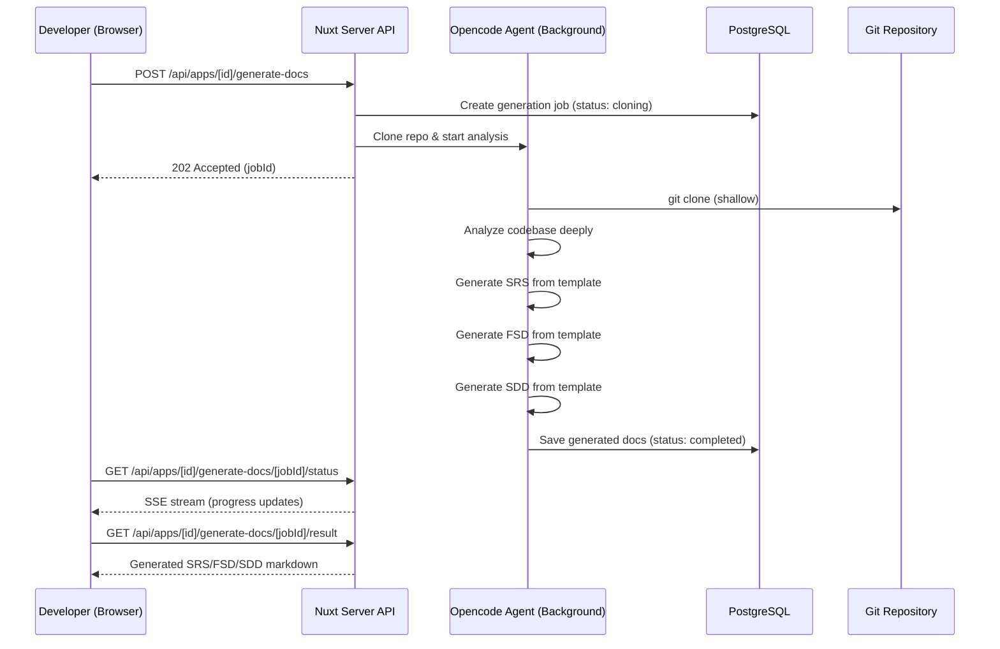

# 🚀 SRS/FSD/SDD Generator — Implementation Plan

## Overview

Build a feature for the **Developer** member role that generates Software Requirements Specification (SRS), Functional Specification Document (FSD), and System Design Document (SDD) from a Git repository input. The system uses **Opencode** as a background AI agent to deeply analyze the codebase and populate the templates.

---

## Architecture



---

## New Environment Variables

```env
# Opencode Agent Config (base64-encoded opencode config.json)
OPENCODE_CONFIG_B64=<base64 encoded JSON>
```

The base64-decoded config.json should contain:
```json
{
  "$schema": "https://opencode.ai/config.json",
  "provider": {
    "openrouter": {
      "npm": "@ai-sdk/openai-compatible",
      "name": "OpenRouter",
      "options": {
        "baseURL": "https://openrouter.ai/api/v1",
        "apiKey": "<key>"
      },
      "models": {
        "anthropic/claude-sonnet-4": {
          "name": "Claude Sonnet 4"
        }
      }
    }
  },
  "model": "openrouter/anthropic/claude-sonnet-4",
  "permission": {
    "edit": "deny",
    "bash": "allow",
    "read": "allow"
  }
}
```

---

## Database Schema Changes

### New table: `doc_generation_jobs`

| Column | Type | Description |
|:---|:---|:---|
| `id` | `serial` PK | Job ID |
| `app_id` | `integer` FK → apps | Which app this belongs to |
| `user_id` | `integer` FK → users | Who triggered the generation |
| `repo_url` | `text` | Git repository URL |
| `status` | `text` | `cloning` → `analyzing` → `generating_srs` → `generating_fsd` → `generating_sdd` → `completed` / `failed` |
| `progress_pct` | `integer` | 0-100 progress |
| `progress_message` | `text` | Human-readable status |
| `srs_content` | `text` | Generated SRS markdown |
| `fsd_content` | `text` | Generated FSD markdown |
| `sdd_content` | `text` | Generated SDD markdown |
| `error_message` | `text` | Error details if failed |
| `created_at` | `timestamp` | Job creation time |
| `completed_at` | `timestamp` | Job completion time |

---

## Files to Create/Modify

### Server-side (Backend)

| File | Action | Purpose |
|:---|:---|:---|
| `server/database/schema/doc-generation-jobs.ts` | **Create** | Drizzle schema for the jobs table |
| `server/lib/opencode-agent.ts` | **Create** | Opencode SDK wrapper — decodes config from env, manages sessions |
| `server/lib/doc-generator.ts` | **Create** | Core orchestrator — clones repo, builds prompts from templates, runs agent |
| `server/api/apps/[id]/generate-docs/index.post.ts` | **Create** | POST endpoint to trigger generation |
| `server/api/apps/[id]/generate-docs/[jobId]/status.get.ts` | **Create** | SSE endpoint for real-time progress |
| `server/api/apps/[id]/generate-docs/[jobId]/result.get.ts` | **Create** | GET endpoint for completed results |
| `server/api/apps/[id]/generate-docs/index.get.ts` | **Create** | GET list of all generation jobs for an app |

### Client-side (Frontend)

| File | Action | Purpose |
|:---|:---|:---|
| `pages/apps/[id]/generate-docs.vue` | **Create** | Main page — repo input, doc type selection, progress UI, results viewer |
| `components/docs/DocGeneratorForm.vue` | **Create** | Repository URL input + doc type selector |
| `components/docs/DocGenerationProgress.vue` | **Create** | Real-time progress bar with status messages |
| `components/docs/DocResultViewer.vue` | **Create** | Tabbed markdown viewer for SRS/FSD/SDD with copy/download |
| `composables/useDocGenerator.ts` | **Create** | Composable for managing doc generation state |
| `store/docGenerator.ts` | **Create** | Pinia store for generation jobs history |

### Configuration

| File | Action | Purpose |
|:---|:---|:---|
| `nuxt.config.ts` | **Modify** | Add `opencodeConfigB64` to runtimeConfig |
| `.env` | **Modify** | Add `OPENCODE_CONFIG_B64` |

---

## Implementation Order

### Phase 1: Database & Config
1. Create Drizzle schema for `doc_generation_jobs`
2. Add env variable support for Opencode config
3. Update `nuxt.config.ts` runtimeConfig

### Phase 2: Opencode Agent Integration  
4. Create `opencode-agent.ts` — SDK wrapper
5. Create `doc-generator.ts` — core orchestrator with template loading

### Phase 3: API Endpoints
6. POST trigger endpoint
7. SSE status endpoint
8. GET result endpoint
9. GET job history endpoint

### Phase 4: Frontend UI
10. Create the generation page
11. Build form, progress, and result viewer components
12. Create composable and store

---

## Key Design Decisions

> [!IMPORTANT]
> - **Opencode runs as a managed server** via `@opencode-ai/sdk` `createOpencode()` — spun up per-job and shut down after
> - **Repository cloned to `/tmp`** with shallow clone for speed
> - **Templates are loaded at runtime** from the `templates/` directory
> - **SSE streaming** for real-time progress (not polling)
> - **Config decoded from base64** at server startup from `OPENCODE_CONFIG_B64` env var
> - **Permission model**: Opencode gets read + bash (for `git clone`, `find`, `cat`), but NO write/edit

> [!WARNING]
> The Opencode agent will need `opencode-ai` CLI and `@opencode-ai/sdk` installed as project dependencies.

Shall I proceed with implementation?
