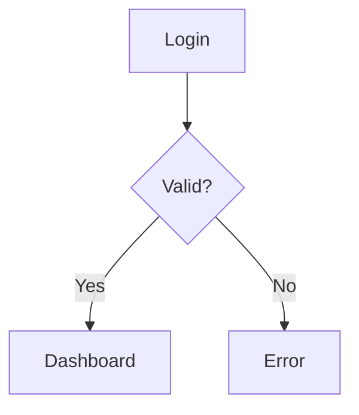

# Functional Specification Document (FSD) — {{PROJECT_NAME}}

| Informasi Dokumen | Detail |
|---|---|
| **Nama Proyek** | {{PROJECT_NAME}} |
| **Versi Dokumen** | 1.0 (FSD) |
| **Tanggal** | {{CURRENT_DATE}} |
| **Status** | Draft — Tahap 2: User Flow |
| **Referensi** | [SRS.md](./SRS.md) · [GIT-SNAPSHOT.md](./GIT-SNAPSHOT.md) |
| **Git Snapshot** | {{CURRENT_DATE}} — [GIT-SNAPSHOT.md](./GIT-SNAPSHOT.md) |

---

## Daftar Isi

1. [Pendahuluan](#1-pendahuluan)
2. [Aktor & Konteks Sistem](#2-aktor--konteks-sistem)
3. [Alur Lintas-Platform (Cross-Cutting)](#3-alur-lintas-platform-cross-cutting)
4. [Alur per Modul / Domain](#4-alur-per-modul--domain)
5. [Alur End-to-End](#5-alur-end-to-end)
6. [Matriks Alur → Requirement SRS](#6-matriks-alur--requirement-srs)

---

## 1. Pendahuluan

Dokumen ini mendeskripsikan **alur kerja fungsional (user flow)** sistem {{PROJECT_NAME}} dari perspektif setiap aktor. Setiap alur disusun dalam format:

- **Aktor** — siapa yang menjalankan alur
- **Entry Point** — halaman/rute awal
- **Prasyarat** — kondisi yang harus terpenuhi
- **Langkah-langkah** — urutan interaksi step-by-step
- **API Endpoint** — layanan backend yang terlibat (jika ada)
- **Jalur Alternatif / Error** — kondisi gagal atau cabang lain
- **Diagram Mermaid** — representasi visual alur

---

## 2. Aktor & Konteks Sistem

### 2.1 Daftar Aktor

> **Agent Instruction:** Identify actors from auth middleware, role checks, route groups, and mobile vs web entry points.

| Aktor | Platform | Peran Utama |
|---|---|---|
| {{Actor}} | {{Platform}} | {{Primary role}} |

### 2.2 Diagram Konteks Sistem

```mermaid
flowchart TB
    subgraph Actors["Aktor"]
        A1[{{Actor 1}}]
    end
    subgraph System["{{PROJECT_NAME}}"]
        WEB[Web]
        API[Backend API]
        DB[(Database)]
    end
    A1 --> WEB
    WEB --> API
    API --> DB
```

### 2.3 Variasi Konfigurasi / Feature Flags

> **Agent Instruction:** If the codebase has tenant config, feature flags, or conditional modules, document how they affect flows.

| Konfigurasi | Dampak pada Alur |
|---|---|
| {{Flag}} | {{Impact}} |

---

## 3. Alur Lintas-Platform (Cross-Cutting)

### 3.1 Alur Autentikasi & Otorisasi

| Atribut | Detail |
|---|---|
| **Aktor** | Semua pengguna |
| **Entry Point** | {{Login route}} |
| **Prasyarat** | {{Prerequisites}} |

**Langkah-langkah:**

1. {{Step 1}}
2. {{Step 2}}

**Jalur Alternatif / Error:**

| Kondisi | Respons Sistem |
|---|---|
| {{Condition}} | {{Response}} |



### 3.2 Alur Manajemen Password

| Alur | Entry Point | Endpoint Kunci |
|---|---|---|
| Lupa password | {{Route}} | {{API}} |
| Reset password | {{Route}} | {{API}} |

*(Agent: Add other cross-cutting flows: permissions, notifications, multi-tenant switch, etc.)*

---

## 4. Alur per Modul / Domain

> **Agent Instruction:** For each major domain discovered (orders, scheduling, admin, mobile driver, etc.), document the primary user flows. Include mermaid flowcharts and sequence diagrams for complex flows.

### 4.1 {{Domain / Module Name}}

| Atribut | Detail |
|---|---|
| **Aktor** | {{Actor}} |
| **Entry Point** | {{Route}} |
| **Endpoint** | {{API endpoints}} |

**Langkah-langkah:**

1. {{Step}}
2. {{Step}}

```mermaid
flowchart TD
    Start[{{Entry}}] --> End[{{Outcome}}]
```

*(Agent: Duplicate §4.x sections for each major domain)*

---

## 5. Alur End-to-End — Siklus Lengkap

> **Agent Instruction:** Map the full lifecycle from setup/onboarding through core operation to completion/reporting.

```mermaid
flowchart TB
    subgraph Phase1["Fase 1: Setup"]
        S1[{{Setup step}}]
    end
    subgraph Phase2["Fase 2: Operasi"]
        S2[{{Core operation}}]
    end
    subgraph Phase3["Fase 3: Closing"]
        S3[{{Completion}}]
    end
    Phase1 --> Phase2 --> Phase3
```

---

## 6. Matriks Alur → Requirement SRS

| Alur FSD | Requirement SRS | Aktor |
|---|---|---|
| {{Flow reference}} | {{FR-XX}} | {{Actor}} |

---

## Riwayat Revisi

| Versi | Tanggal | Perubahan | Author |
|---|---|---|---|
| 1.0 | {{CURRENT_DATE}} | Draft awal — FSD | Orbit Docs Agent |

---

> **Catatan:** Dokumentasi lengkap tersedia di [SRS.md](./SRS.md), [SDD.md](./SDD.md), dan [GIT-SNAPSHOT.md](./GIT-SNAPSHOT.md).
