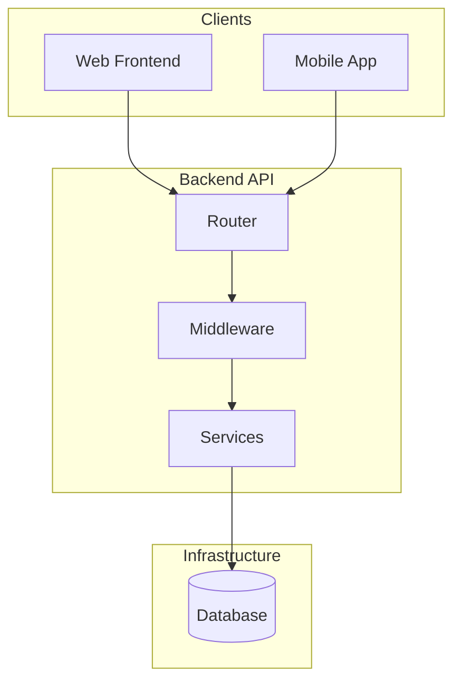
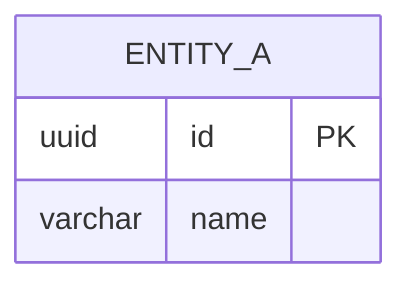

# SDD Backend — {{PROJECT_NAME}}

| Informasi Dokumen | Detail |
|---|---|
| **Nama Proyek** | {{PROJECT_NAME}} |
| **Versi Dokumen** | 1.0 (SDD Backend) |
| **Tanggal** | {{CURRENT_DATE}} |
| **Status** | Draft — Arsitektur Backend & ERD |
| **Referensi** | [SRS.md](./SRS.md) · [FSD.md](./FSD.md) · [SDD.md](./SDD.md) · [GIT-SNAPSHOT.md](./GIT-SNAPSHOT.md) |
| **Codebase** | `{{REPO_NAME}}/` |
| **Git Snapshot** | `{{COMMIT_SHORT}}` · {{COMMIT_DATE}} · `{{BRANCH}}` |

---

## Daftar Isi

1. [Pendahuluan](#1-pendahuluan)
2. [Arsitektur Backend](#2-arsitektur-backend)
3. [Struktur Proyek & Feature Module](#3-struktur-proyek--feature-module)
4. [Middleware & Autentikasi API](#4-middleware--autentikasi-api)
5. [Integrasi Eksternal & Background Jobs](#5-integrasi-eksternal--background-jobs)
6. [Arsitektur Database](#6-arsitektur-database)
7. [Konvensi & Pola Desain](#7-konvensi--pola-desain)
8. [Katalog Entitas per Domain](#8-katalog-entitas-per-domain)
9. [Diagram ERD](#9-diagram-erd)
10. [Matriks Entitas → Modul SRS/FSD](#10-matriks-entitas--modul-srsfsd)

---

## 1. Pendahuluan

> **Agent Instruction:** Describe the backend's role in the product. Identify language, framework, ORM, and entry point from this repository only.

---

## 2. Arsitektur Backend

| Aspek | Detail |
|---|---|
| **Bahasa** | {{Language}} |
| **Framework** | {{Framework}} |
| **ORM** | {{ORM}} |
| **Base Path API** | {{API prefix}} |

---

## 3. Struktur Proyek & Feature Module

> **Agent Instruction:** Map the directory tree and list feature modules with endpoint prefixes.

---

## 4. Middleware & Autentikasi API

> **Agent Instruction:** Document auth middleware, route groups (public vs authenticated), and login endpoints.

---

## 5. Integrasi Eksternal & Background Jobs

> **Agent Instruction:** List external services, cron jobs, queues, and webhooks.

---

## 6. Arsitektur Database

| Aspek | Detail |
|---|---|
| **DBMS** | {{Database}} |
| **ORM** | {{ORM}} |
| **Primary Key** | {{PK strategy}} |
| **Multi-Tenant** | {{Yes/No — how}} |

---

## 7. Konvensi & Pola Desain

> **Agent Instruction:** Document naming, tenant scoping, soft delete, audit patterns.

---

## 8. Katalog Entitas per Domain

> **Agent Instruction:** List entities/tables grouped by domain with key attributes.

---

## 9. Diagram ERD

> **Agent Instruction:** Provide mermaid ERD sub-diagrams for major domains (tenant/auth, core domain, supporting).

---

## 10. Matriks Entitas → Modul SRS/FSD

| Domain ERD | Entitas Utama | Modul SRS | Alur FSD |
|---|---|---|---|
| {{Domain}} | {{Entity}} | {{FR-XX}} | {{§X}} |

---

## Riwayat Revisi

| Versi | Tanggal | Perubahan | Author |
|---|---|---|---|
| 1.0 | {{CURRENT_DATE}} | Draft awal — SDD Backend | Orbit Docs Agent |
