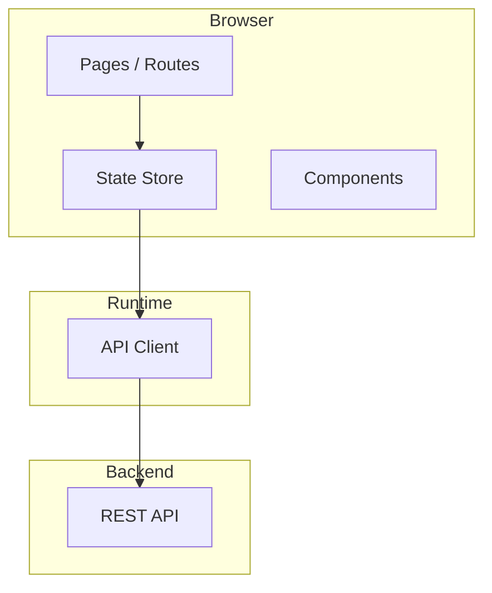

# SDD Frontend — {{PROJECT_NAME}}

| Informasi Dokumen | Detail |
|---|---|
| **Nama Proyek** | {{PROJECT_NAME}} |
| **Versi Dokumen** | 1.0 (SDD Frontend) |
| **Tanggal** | {{CURRENT_DATE}} |
| **Status** | Draft — Arsitektur Web Dashboard |
| **Referensi** | [SRS.md](./SRS.md) · [FSD.md](./FSD.md) · [SDD.md](./SDD.md) · [GIT-SNAPSHOT.md](./GIT-SNAPSHOT.md) |
| **Codebase** | `{{REPO_NAME}}/` |
| **Git Snapshot** | `{{COMMIT_SHORT}}` · {{COMMIT_DATE}} · `{{BRANCH}}` |

---

## Daftar Isi

1. [Pendahuluan](#1-pendahuluan)
2. [Arsitektur Frontend](#2-arsitektur-frontend)
3. [Tech Stack & Modul](#3-tech-stack--modul)
4. [Struktur Direktori](#4-struktur-direktori)
5. [Routing & Halaman](#5-routing--halaman)
6. [State Management](#6-state-management)
7. [Autentikasi & Otorisasi](#7-autentikasi--otorisasi)
8. [Middleware & Feature Flags](#8-middleware--feature-flags)
9. [Komunikasi API](#9-komunikasi-api)
10. [Layout & Komponen UI](#10-layout--komponen-ui)
11. [Matriks Halaman → Modul SRS/FSD](#11-matriks-halaman--modul-srsfsd)

---

## 1. Pendahuluan

> **Agent Instruction:** Describe the web frontend's role — SPA/SSR, portals (admin, public), and primary users.

---

## 2. Arsitektur Frontend

| Aspek | Detail |
|---|---|
| **Framework** | {{Framework}} |
| **Styling** | {{CSS approach}} |
| **State** | {{State library}} |
| **Auth** | {{Auth approach}} |

---

## 3. Tech Stack & Modul

> **Agent Instruction:** List key dependencies from package.json and registered modules/plugins.

---

## 4. Struktur Direktori

> **Agent Instruction:** Summarize pages/, components/, store/, middleware/, etc.

---

## 5. Routing & Halaman

> **Agent Instruction:** Group routes by actor/access (public, authenticated, admin). Table of route → feature.

---

## 6. State Management

> **Agent Instruction:** List stores/modules and their API endpoints.

---

## 7. Autentikasi & Otorisasi

> **Agent Instruction:** Document login flow, session/token handling, RBAC/permissions.

---

## 8. Middleware & Feature Flags

> **Agent Instruction:** List route middleware and feature-flag gates.

---

## 9. Komunikasi API

> **Agent Instruction:** Document HTTP client wrapper, auth headers, error handling, BFF/server routes if any.

---

## 10. Layout & Komponen UI

> **Agent Instruction:** Describe layout structure, shared components, UI patterns.

---

## 11. Matriks Halaman → Modul SRS/FSD

| Halaman Frontend | Store/Module | Modul SRS | Alur FSD |
|---|---|---|---|
| {{Route}} | {{Store}} | {{FR-XX}} | {{§X}} |

---

## Riwayat Revisi

| Versi | Tanggal | Perubahan | Author |
|---|---|---|---|
| 1.0 | {{CURRENT_DATE}} | Draft awal — SDD Frontend | Orbit Docs Agent |
