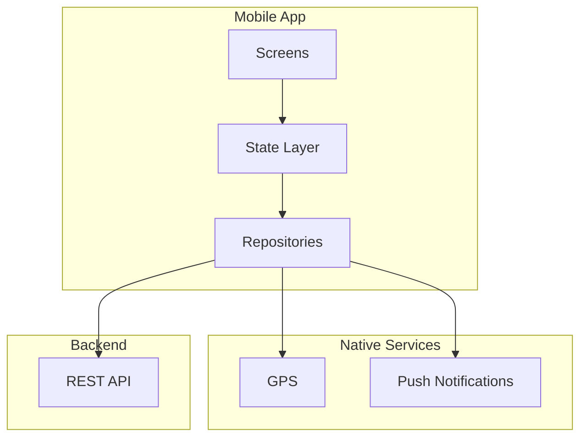

# SDD Mobile — {{PROJECT_NAME}}

| Informasi Dokumen | Detail |
|---|---|
| **Nama Proyek** | {{PROJECT_NAME}} |
| **Versi Dokumen** | 1.0 (SDD Mobile) |
| **Tanggal** | {{CURRENT_DATE}} |
| **Status** | Draft — Arsitektur Mobile App |
| **Referensi** | [SRS.md](./SRS.md) · [FSD.md](./FSD.md) · [SDD.md](./SDD.md) · [GIT-SNAPSHOT.md](./GIT-SNAPSHOT.md) |
| **Codebase** | `{{REPO_NAME}}/` |
| **Git Snapshot** | `{{COMMIT_SHORT}}` · {{COMMIT_DATE}} · `{{BRANCH}}` |

---

## Daftar Isi

1. [Pendahuluan](#1-pendahuluan)
2. [Arsitektur Mobile](#2-arsitektur-mobile)
3. [Tech Stack & Dependencies](#3-tech-stack--dependencies)
4. [Struktur Direktori](#4-struktur-direktori)
5. [Routing & Halaman](#5-routing--halaman)
6. [State Management](#6-state-management)
7. [Autentikasi & Session](#7-autentikasi--session)
8. [Komunikasi API](#8-komunikasi-api)
9. [Layanan Native (GPS, Background, Push)](#9-layanan-native-gps-background-push)
10. [Komponen & UI Patterns](#10-komponen--ui-patterns)
11. [Offline & Local Storage](#11-offline--local-storage)
12. [Build Flavors & Deployment](#12-build-flavors--deployment)
13. [Matriks Halaman → Modul SRS/FSD](#13-matriks-halaman--modul-srsfsd)

---

## 1. Pendahuluan

> **Agent Instruction:** Describe the mobile app's purpose, target users (e.g., field drivers), and platform support.

---

## 2. Arsitektur Mobile

| Aspek | Detail |
|---|---|
| **Framework** | {{Flutter/React Native/etc.}} |
| **Arsitektur** | {{Pattern}} |
| **State** | {{BLoC/Redux/etc.}} |
| **Routing** | {{Router}} |

---

## 3. Tech Stack & Dependencies

> **Agent Instruction:** List key packages from pubspec.yaml / package.json.

---

## 4. Struktur Direktori

> **Agent Instruction:** Map lib/modules/, repositories/, services/, etc.

---

## 5. Routing & Halaman

> **Agent Instruction:** Table of routes/screens with descriptions and navigation diagram.

---

## 6. State Management

> **Agent Instruction:** List BLoCs/stores per feature module.

---

## 7. Autentikasi & Session

> **Agent Instruction:** Login flow, token storage, session guards.

---

## 8. Komunikasi API

> **Agent Instruction:** HTTP client, headers, error interceptor, key endpoints.

---

## 9. Layanan Native (GPS, Background, Push)

> **Agent Instruction:** Document GPS, background services, FCM/push, camera if used.

---

## 10. Komponen & UI Patterns

> **Agent Instruction:** Shared widgets, theming, localization.

---

## 11. Offline & Local Storage

> **Agent Instruction:** Secure storage, cache, offline behavior.

---

## 12. Build Flavors & Deployment

> **Agent Instruction:** Environments, entry points, app store config.

---

## 13. Matriks Halaman → Modul SRS/FSD

| Halaman Mobile | State/Repository | Modul SRS | Alur FSD |
|---|---|---|---|
| {{Screen}} | {{BLoC}} | {{FR-XX}} | {{§X}} |

---

## Riwayat Revisi

| Versi | Tanggal | Perubahan | Author |
|---|---|---|---|
| 1.0 | {{CURRENT_DATE}} | Draft awal — SDD Mobile | Orbit Docs Agent |
