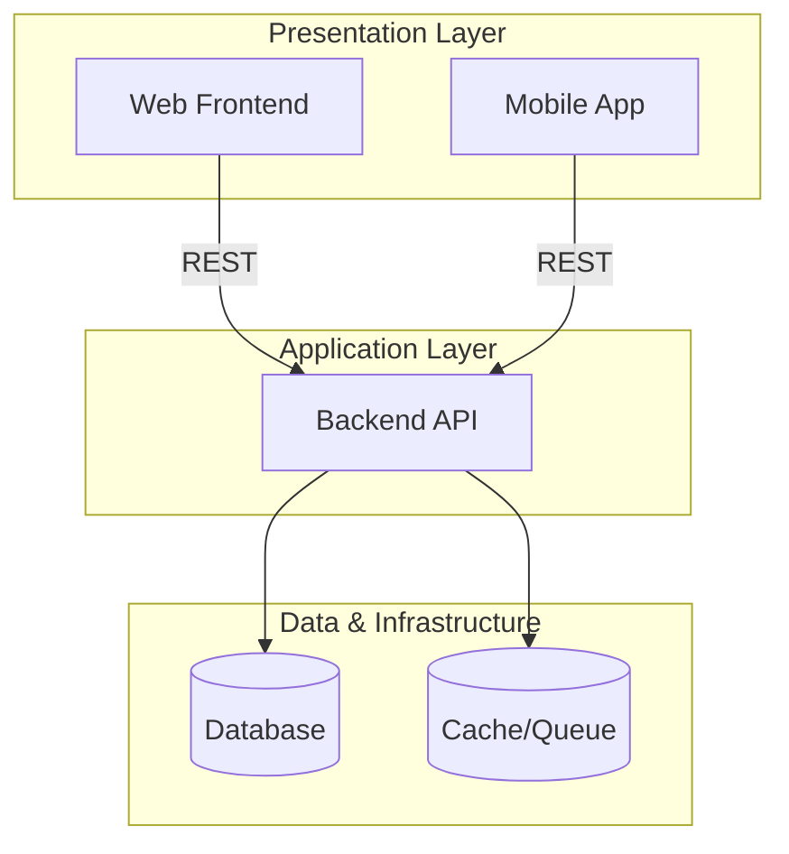

# System Design Document (SDD) — {{PROJECT_NAME}}

| Informasi Dokumen | Detail |
|---|---|
| **Nama Proyek** | {{PROJECT_NAME}} |
| **Versi Dokumen** | 1.0 (SDD Indeks) |
| **Tanggal** | {{CURRENT_DATE}} |
| **Status** | Draft — Tahap 3: System Design |
| **Referensi** | [SRS.md](./SRS.md) · [FSD.md](./FSD.md) · [GIT-SNAPSHOT.md](./GIT-SNAPSHOT.md) |

---

## Daftar Isi

1. [Pendahuluan](#1-pendahuluan)
2. [Arsitektur Sistem](#2-arsitektur-sistem)
3. [Dokumen SDD](#3-dokumen-sdd)
4. [Pemetaan Komponen](#4-pemetaan-komponen)
5. [Referensi Git (Codebase Snapshot)](#5-referensi-git-codebase-snapshot)

---

## 1. Pendahuluan

Dokumen ini merupakan **indeks System Design Document (SDD)** proyek {{PROJECT_NAME}}. Desain sistem dipisah menjadi dokumen spesifik per codebase/layer agar masing-masing dapat dipelihara secara independen:

| Dokumen | Scope | Codebase |
|---|---|---|
| **SDD-Backend.md** (jika ada) | Arsitektur API, middleware, integrasi, ERD | `{{backend-repo}}/` |
| **SDD-Frontend.md** (jika ada) | Arsitektur web dashboard, routing, state | `{{frontend-repo}}/` |
| **SDD-Mobile.md** (jika ada) | Arsitektur mobile app, native services | `{{mobile-repo}}/` |

> **Agent Instruction:** List only the repositories that exist in this product. Link each to its generated per-repo SDD file.

---

## 2. Arsitektur Sistem

### Alur Data Utama

> **Agent Instruction:** Describe how each client communicates with the backend and external services.

1. {{Data flow 1}}
2. {{Data flow 2}}

---

## 3. Dokumen SDD

> **Agent Instruction:** Summarize what each per-repo SDD covers and link to the file.

### SDD Backend

→ Baca lengkap: **[SDD-Backend.md](./SDD-Backend.md)** *(or per-repo filename)*

### SDD Frontend

→ Baca lengkap: **[SDD-Frontend.md](./SDD-Frontend.md)**

### SDD Mobile

→ Baca lengkap: **[SDD-Mobile.md](./SDD-Mobile.md)**

---

## 4. Pemetaan Komponen

| Layer | Teknologi | Dokumen SDD | Modul SRS |
|---|---|---|---|
| {{Layer}} | {{Tech}} | {{SDD file}} | {{FR-XX}} |

---

## 5. Referensi Git (Codebase Snapshot)

> **Agent Instruction:** Copy the snapshot table from GIT-SNAPSHOT.md or git metadata collected during generation.

| Codebase | Commit | Tanggal Commit (UTC) | Dokumen SDD |
|---|---|---|---|
| `{{repo}}/` | `{{sha}}` | {{date}} | [SDD-{{Layer}}.md](./SDD-{{Layer}}.md) |

> Panduan memperbarui dokumentasi: **[GIT-SNAPSHOT.md](./GIT-SNAPSHOT.md)**

---

## Riwayat Revisi

| Versi | Tanggal | Perubahan | Author |
|---|---|---|---|
| 1.0 | {{CURRENT_DATE}} | Draft awal — SDD indeks | Orbit Docs Agent |

---

> **Dokumentasi lengkap {{PROJECT_NAME}}:**
> - [SRS — Software Requirements Specification](./SRS.md)
> - [FSD — Functional Specification Document](./FSD.md)
> - **SDD — System Design Document (Indeks)** ← dokumen ini
> - [GIT-SNAPSHOT — Referensi Commit Codebase](./GIT-SNAPSHOT.md)
